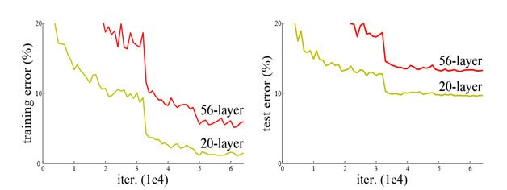

# ResNet以及在CIFAR上实现分类

## ResNet介绍

ResNet全名Residual Network残差网络。Kaiming He 的《Deep Residual Learning for Image Recognition》获得了CVPR最佳论文。他提出的深度残差网络在2015年可以说是洗刷了图像方面的各大比赛，以绝对优势取得了多个比赛的冠军。而且它在保证网络精度的前提下，将网络的深度达到了152层，后来又进一步加到1000的深度。论文的开篇先是说明了深度网络的好处：特征等级随着网络的加深而变高，网络的表达能力也会大大提高。因此论文中提出了一个问题：是否可以通过叠加网络层数来获得一个更好的网络呢？作者经过实验发现，单纯的把网络叠起来的深层网络的效果反而不如合适层数的较浅的网络效果。

Resnet网络的提出者Balduzzi D 利用实验设计了在已经训练的浅层网络上，添加identity mapping，按照常理来说，至少添加identity mapping不应该会比未修改的浅层网络表现效果更差，但是根据实验数据表明，并非如此。

|                                    |
| ------------------------------------------------------------ |
| 20层网络与增加层数的56层网络训练错误收敛图 （此图来源于：Deep Residual Learning for Image Recognition） |

随着迭代次数增加，20层网络与56层网络的错误率都在收敛，56层网络的收敛速度明显低于20层，这和预期结果相同，但当迭代次数增加到50000次时，两种网络都收敛至一个稳定值，不再有明显上升或下降，但收敛值却没有如预期的那样，应该呈现出收敛至同一值，56层训练网络的错误率收敛值明显高于20层，也就是说，前者的训练效果远不如前者。作者把这种现象称为degradation problem(降级)。

==注意：这种问题并不是随着网络加深造成的梯度消失或者梯度爆炸，虽然残差网络依然可以解决这两个问题，到那时这两个问题通常都被BN和Relu激活函数得到解决。==

degradation problem的出现证明主流的训练方法存在一定的缺陷，而出现降级的根本原因，并不明确，在“The Shattered Gradients Problem: If resnets are the answer, then what is the question?”中提出了一种说法：神经网络越来越深的时候，反传回来的梯度之间的相关性会越来越差，最后接近白噪声。因为图像是具备局部相关性的，那其实可以认为梯度也应该具备类似的相关性，这样更新的梯度才有意义，如果梯度接近白噪声，那梯度更新可能根本就是在做随机扰动。

**残差模块**：

何恺明团队提出的残差网络结构 将$F(x)$替换为$H(x)=F(x)+x$，非线性网络结构实际上学习的是$H(x)-x$这样一个残差，而为什么要做这么呢？因为，在极端情况下，返回的损失已经很小，效果已经到达了网络的极限，最终学习的$F(x)$为0，也就是说整个二层网络不会造成任何影响，最终是一个恒等映射，那么至少，网络不会存在更差的情况，同时，如果不使用残差网络结构，这一层的输出F'(5)=5.1 期望输出 H(5)=5 ,如果想要学习H函数，使得F'(5)=H(5)=5,这个变化率较低，学习起来是比较困难的。但是如果设计为H(5)=F(5)+5=5.1，进行一种拆分，使得F(5)=0.1，那么学习目标是不是变为F(5)=0，一个映射函数学习使得它输出由0.1变为0，这个是比较简单的。也就是说引入残差后的映射对输出变化更敏感了。进一步理解：如果F'(5)=5.1 ,现在继续训练模型，使得映射函数F'(5)=5。(5.1-5)/5.1=2%，也许你脑中已经闪现把学习率从0.01设置为0.0000001。浅层还好用，深层的话可能就不太好使了。如果设计为残差结构呢？5.1变化为5，也就是F(5)=0.1变化为F(5)=0.这个变化率增加了100%。引入残差后映射对输出变化变的更加敏感了，这也就是为什么ResNet虽然层数很多但是收敛速度也不会低的原因。明显后者输出变化对权重的调整作用更大，所以效果更好。残差的思想都是去掉相同的主体部分，从而突出微小的变化，看到残差网络我第一反应就是差分放大器。这也就是当网络模型我们已经设计到一定的深度，出现了精准度下降，如果使用残差结构就会很容易的调节到一个更好的效果，即使你不知道此刻的深度是不是最佳，但是起码准确度不会下降。

## 手动实现ResNet18

### 残差模块实现

### 残差网络

https://blog.csdn.net/xiaosongshine/article/details/90902628?depth_1-utm_source=distribute.pc_relevant.none-task&utm_source=distribute.pc_relevant.none-task